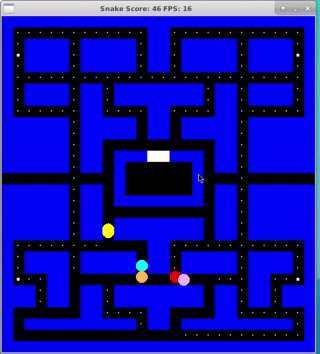

# Pacman

This project is the Capstone project in the [Udacity C++ Nanodegree Program](https://www.udacity.com/course/c-plus-plus-nanodegree--nd213). The game is a tribute to original Pacman to learn c++ implementation. The code was forked from [udacity/CppND-Capstone-Snake-Game](https://github.com/udacity/CppND-Capstone-Snake-Game).

## Dependencies for Running Locally
* cmake >= 3.7
  * All OSes: [click here for installation instructions](https://cmake.org/install/)
* make >= 4.1 (Linux, Mac), 3.81 (Windows)
  * Linux: make is installed by default on most Linux distros
  * Mac: [install Xcode command line tools to get make](https://developer.apple.com/xcode/features/)
  * Windows: [Click here for installation instructions](http://gnuwin32.sourceforge.net/packages/make.htm)
* SDL2 >= 2.0
  * All installation instructions can be found [here](https://wiki.libsdl.org/Installation)
  * Note that for Linux, an `apt` or `apt-get` installation is preferred to building from source.
* gcc/g++ >= 5.4
  * Linux: gcc / g++ is installed by default on most Linux distros
  * Mac: same deal as make - [install Xcode command line tools](https://developer.apple.com/xcode/features/)
  * Windows: recommend using [MinGW](http://www.mingw.org/) (but the combination of [WSL2](https://docs.microsoft.com/en-us/windows/wsl/install-win10) and xrdp like [xfce](https://www.xfce.org/) as a linux environment is more recommended.)

## Build Instructions

1. Clone this repo.
    * `git clone git@github.com:matsuyamaichiro/CppND-Capstone-Snake-Game.git --recurse-submodules` with SSH or
    * `git clone https://github.com/matsuyamaichiro/CppND-Capstone-Snake-Game.git --recurse-submodules` with HTML.
    * This project relies on [googletest](https://github.com/google/googletest) as a thirdparty library.
2. Make a build directory in the top level directory `mkdir build && cd build`
3. Compile: `cmake .. && make`
4. Run it: `./Pacman`.

## How to play
I hope all you have already known the basic rules of Pacman. But **there are some limitations** explained in Rules below.  

### Rules
Currently this game starts immediately after the program running, and ends when all food and power food are eaten by Pacman or Pacman gets touch with Monsters.  
Score is counted 1 up only when Pacman eats 1 of food or power food.  
Unfortunately **the effect of power food has not been implemented yet.** So now Pacman can not eat Monsters even if after eating power food.

### Key assign
&#8592; &#8593; &#8594; &#8595; : Pacman direction
### Characters
* Yellow &#9675; : Pacman  
* Red, Pink, Cyan, Orange &#9675; : Monsters
* White &#11038; : Food
* White &#9723; : Power Food

## Test
The tests are implemented using [googletest](https://github.com/google/googletest) framework. These can be found under `test/` directory.

---
## Rubric Points Met
This information is only for the reviewer of Udacity C++ Nanodegree Program.

### README (All Rubric Points REQUIRED)

| Point                                                              | File                                  | Lines |
|--------------------------------------------------------------------|---------------------------------------|-------|
| A README with instructions is included with the project            | [this][README.md]                     | -     |
| The README indicates which project is chosen.                      | [this][README.md] [ClassStructure.md] | -     |
| The README includes information about each rubric point addressed. | [this][README.md]                     | here  |

### Compiling and Testing (All Rubric Points REQUIRED)

| Point                                | File | Lines |
|--------------------------------------|------|-------|
| The submission must compile and run. | all  | -     |

### Loops, Functions, I/O

| Point                                                                                          | File             | Lines |
|------------------------------------------------------------------------------------------------|-----------------|-------|
| The project demonstrates an understanding of C++ functions and control structures.             | all              | -     |
| The project reads data from a file and process the data, or the program writes data to a file. | [maze.cpp]       | WIP   |
| The project accepts user input and processes the input.                                        | [controller.cpp] | WIP   |

### Object Oriented Programming

| Point                                                                            | File                   | Lines          |
|----------------------------------------------------------------------------------|------------------------|----------------|
| The project uses Object Oriented Programming techniques.                         | all                    | -              |
| Classes use appropriate access specifiers for class members.                     | all                    | -              |
| Class constructors utilize member initialization lists.                          | [game.cpp], [snake.cpp] | WIP            |
| Classes abstract implementation details from their interfaces.                   |                        |                |
| Classes encapsulate behavior.                                                    |                        |                |
| Classes follow an appropriate inheritance hierarchy.                             |                        |                |
| Overloaded functions allow the same function to operate on different parameters. |                        |                |
| Derived class functions override virtual base class functions.                   |                        |                |
| Templates generalize functions in the project.                                   |                        |                |

### Memory Management

| Point                                                                                     | File            | Lines          |
|-------------------------------------------------------------------------------------------|-----------------|----------------|
| The project makes use of references in function declarations.                             |                 |                |
| The project uses destructors appropriately.                                               |                 |                |
| The project uses scope / Resource Acquisition Is Initialization (RAII) where appropriate. |                 |                |
| The project follows the Rule of 5.                                                        |                 |                |
| The project uses move semantics to move data, instead of copying it, where possible.      |                 |                |
| The project uses smart pointers instead of raw pointers.                                  |                 |                | 

### Concurrency

| Point                                        | File            | Lines          |
|----------------------------------------------|-----------------|----------------|
| The project uses multithreading.             |                 |                |
| A promise and future is used in the project. |                 |                |
| A mutex or lock is used in the project.      |                 |                |
| A condition variable is used in the project. |                 |                |   

[main.cpp]: src/main.cpp
[game.cpp]: src/game.cpp
[game.h]: src/game.h
[snake.cpp]: src/snake.cpp
[snake.h]: src/snake.h
[pacman.cpp]: src/pacman.cpp
[pacman.h]: src/pacman.h
[monster.cpp]: src/monster.cpp
[monster.h]: src/monster.h
[maze.cpp]: src/maze.cpp
[maze.h]: src/maze.h
[renderer.cpp]: src/renderer.cpp
[renderer.h]: src/renderer.h
[controller.cpp]: src/controller.cpp
[controller.h]: src/controller.h
[README.md]: ../README.md
[ClassStructure.md]: ../docs/ClassStructure.md